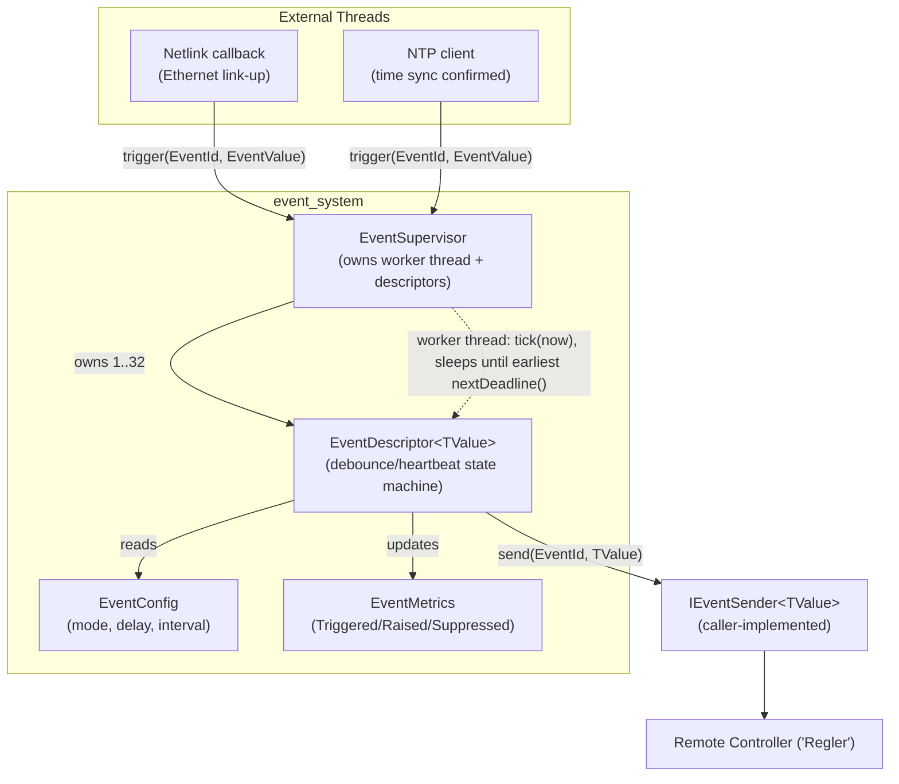
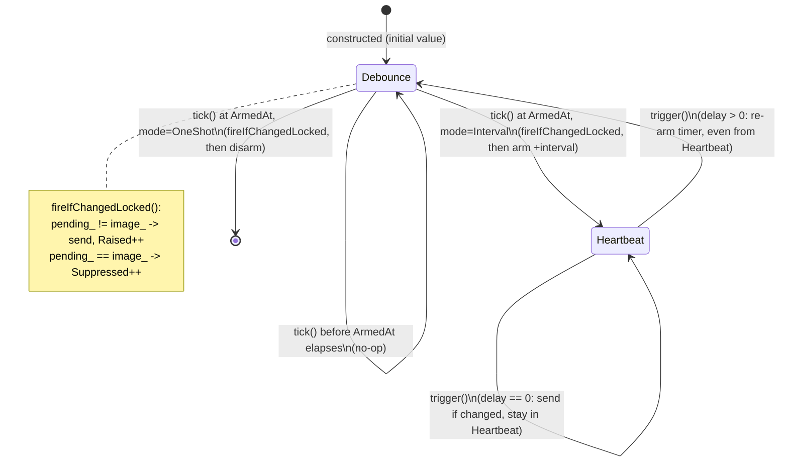
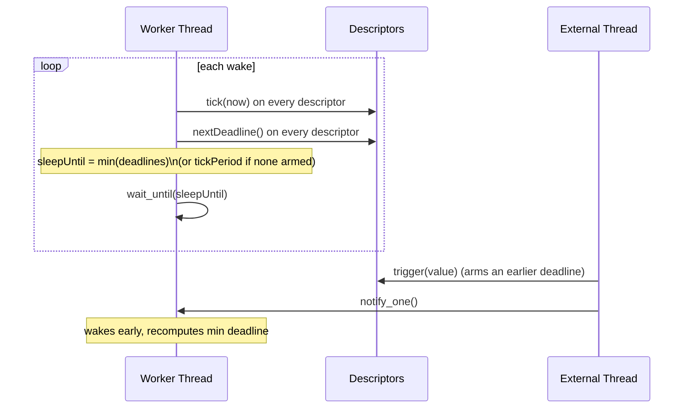
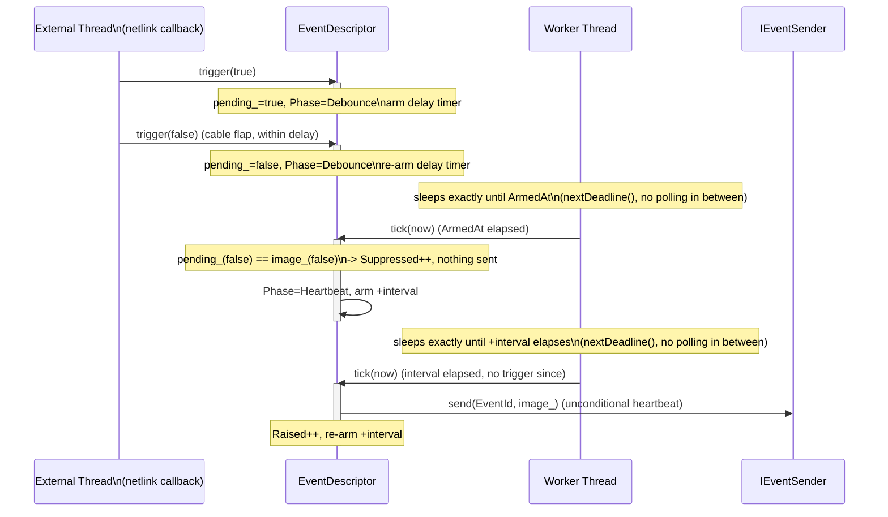
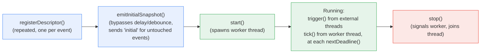

# Internal Event System — Architecture Overview

Namespace: `app::event`
Language: C++20, embedded target (no dynamic threading frameworks, minimal heap use)

## Purpose

Report internal device state changes (e.g. Ethernet channel life, NTP sync status)
to a remote controller ("Regler"). Supports two delivery modes, debouncing of noisy
signals, and heartbeat-style resilience against controller restarts.

## Core Concepts

### Component Overview



`EventDescriptor` implements `IEventDescriptor` so `EventSupervisor` can hold
a type-erased collection of them; `IEventSender<TValue>` keeps the descriptor
receiver-agnostic (it only knows *that* it must send, not *where*).

### EventId
Enum identifying a specific monitored condition (`ChannelLifeEthernet0..3`,
`NtpAlive1`, `NtpAlive2`, ...). Values only, no payload.

### EventMode
- **OneShot** — fires at most once, after `delay` elapses, if the value
  actually changed. Uses debounce (see below).
- **Interval** — fires repeatedly every `interval`, forever, after an initial
  `delay`. Acts as a heartbeat.

### EventConfig
Holds `mode`, `delay`, and `interval`. Validity is guaranteed by the caller:
- OneShot: only `delay` is meaningful.
- Interval: `delay` may be `0` or `>0`; `interval` is always `>0`.

### Image vs Pending
Each event descriptor keeps two values:
- `image_` — the last value actually **sent** to the controller.
- `pending_` — the latest **raw** value reported via `trigger()`.

`tick()` compares them to decide whether to send, and updates `image_` only
when a value is actually transmitted.

### Sender
`IEventSender<TValue>` is a small interface (`send(EventId, TValue)`).
The sender is bound to the descriptor at registration time — the event itself
carries no knowledge of its destination. Different descriptors can use
different senders (e.g. one per receiver/controller channel).

### Metrics
`EventMetrics` counts, per event, how many times it was triggered, actually
raised (sent), or suppressed (debounced away). Exposed as atomics for
Prometheus-style scraping.

## Timing Behavior

### Descriptor State Machine

The internal `Phase` (`Debounce` / `Heartbeat`) drives every timing decision.
`trigger()` and `tick()` are the only two entry points that move it:



Two shapes fall out of this one machine:
- **OneShot**: `Debounce -> [*]` — fires at most once per trigger cycle, then
  goes idle (no heartbeat loop).
- **Interval**: `Debounce <-> Heartbeat` forever — once the first debounce
  settles, it heartbeats on every `interval` and can be knocked back into
  `Debounce` by any later `trigger()` with `delay > 0`.

### Delay + Debounce (OneShot, and Interval with delay > 0)
`trigger()` restarts the delay timer on every call. Only when the timer
elapses **without a further trigger** does `tick()` evaluate whether to send:
- If `pending_ != image_` → send, update `image_`.
- If `pending_ == image_` (value returned to its prior state during the
  delay window) → suppressed, nothing sent.

This absorbs short flapping (e.g. a cable unplugged and replugged within the
delay window) while still reporting a change that persists past the delay.

### Immediate mode (Interval, delay == 0)
`trigger()` sends immediately if the value changed, bypassing the delay
mechanism entirely. `interval` still governs the subsequent heartbeat cadence.

### Heartbeat (Interval only)
On every `interval` elapsed, `tick()` sends the current `image_`
**unconditionally** — regardless of whether the value changed. This is the
main reason Interval mode exists: if the remote controller restarts and loses
its process image, it will receive the current state again within one
`interval`, without needing a new physical trigger.

OneShot events do not heartbeat — they fire once and stay silent afterward,
retaining their `image_` for read access only.

## Initial Value & Startup Snapshot

Every event is registered with an `initial` value. Convention: **all events
start with `initial = false`** (conservative default — "not confirmed alive"
until a real trigger says otherwise).

`emitSnapshot()` sends the current `image_` immediately, bypassing delay and
debounce. `EventSupervisor::emitInitialSnapshot()` calls this for all
registered events once, after registration and before `start()`, so the
controller receives a full state picture at startup — even for events that
haven't triggered yet (in which case it receives `initial`).

## EventSupervisor

Owns a fixed set of `EventDescriptor` instances and a dedicated thread:

1. **Registration phase** — `registerDescriptor()` may only be called before `start()` (enforced by an `assert`).
   No runtime registration; this removes the need for a lock around the
   descriptor collection itself.
2. **`emitInitialSnapshot()`** — sends the startup snapshot (see above).
3. **`start()`** — spawns the worker thread, which calls `tick(now)` on every
   descriptor, then sleeps precisely until the earliest deadline any descriptor reports via
   `nextDeadline()` — not a fixed period. `tickPeriod` (default 100 ms, configurable via the
   constructor) is only used as an idle-poll fallback when no descriptor currently has an armed
   deadline (e.g. before any `trigger()` has been received).
4. **`trigger(EventId, EventValue)`** — callable from any external thread
   (e.g. a netlink callback or NTP client) to report a raw state change; also wakes the worker thread
   in case it just armed a deadline earlier than the one the worker is currently sleeping until.
5. **`stop()`** — signals the worker thread to exit and joins it.

### Adaptive Wake

Rather than waking at a fixed cadence and checking every descriptor for no reason, the worker computes
the minimum of all descriptors' `nextDeadline()` after each `tick()` pass and sleeps exactly until then:



This means a `OneShot` with a 50 ms delay fires within ~50 ms of its trigger rather than waiting for the
next multiple of `tickPeriod`, while a quiescent supervisor with nothing armed yet only wakes every
`tickPeriod` until the first `trigger()` arrives.

### Thread Safety

- The descriptor collection is immutable after `start()` — safe to iterate
  without a lock.
- Each `EventDescriptor` protects its own internal state (`pending_`,
  `image_`, `armedAt_`) with a lightweight per-descriptor `SpinLock`, since
  `trigger()` (external threads) and `tick()` (supervisor thread) can run
  concurrently.

### Debounce + Heartbeat in Action

Example: an Ethernet link that flaps once during the debounce window, then
settles, followed by an unrelated heartbeat resend with no new trigger.



## Ownership of Trigger Calls

The event system does not decide *when* a condition is true — it only
manages *how* that report is delayed, debounced, and delivered. The owner of
the underlying state decides what "true" means and calls `trigger()`
accordingly:

- Ethernet channel life → netlink interface monitoring callback.
- NTP alive → the NTP client itself, once it considers time actually
  synchronized (not merely "server reachable").

## Type Safety

`EventDescriptor<TValue>::trigger()` calls `std::get<TValue>(value)` internally
— passing an `EventValue` that doesn't hold the descriptor's declared `TValue`
alternative throws/crashes (`std::bad_variant_access` via `std::get`). Callers
must match the declared payload type for each `EventId`. To support a new
payload type, extend the `EventValue` variant in `EventValue.hpp`.

## Startup & Lifecycle Flow



`registerDescriptor()` and `emitInitialSnapshot()` are only valid before
`start()` (enforced by `assert`) — this is what lets the supervisor iterate
its descriptor collection without a lock once running.

## Example

```cpp
#include "app/event/EventDescriptor.hpp"
#include "app/event/EventSupervisor.hpp"

using namespace app::event;
using namespace std::chrono_literals;

class ConsoleSender final : public IEventSender<bool> {
 public:
  void send(EventId id, bool value) noexcept override {
    // route the event to the actual transport (wire protocol, IPC, ...)
  }
};

ConsoleSender sender;
EventSupervisor supervisor(100ms);  // tickPeriod: idle-poll fallback only, defaults to 100ms

supervisor.registerDescriptor(std::make_unique<EventDescriptor<bool>>(
    EventId::ChannelLifeEthernet0,
    EventConfig{.mode = EventMode::Interval, .delay = 10000ms, .interval = 30000ms},
    sender, /*initial=*/false));

supervisor.registerDescriptor(std::make_unique<EventDescriptor<bool>>(
    EventId::NtpAlive1,
    EventConfig{.mode = EventMode::OneShot, .delay = 5000ms},
    sender, /*initial=*/false));

supervisor.emitInitialSnapshot();
supervisor.start();

// from netlink callback:
supervisor.trigger(EventId::ChannelLifeEthernet0, EventValue{true});

// on shutdown:
supervisor.stop();
```

See `examples/main.cpp` for a runnable demo (`event_system_demo`) simulating a
debounced cable flap and heartbeat repeats over ~10s.

## Adding a New Event

1. Append an ID to `EventId` (before `Count`, which is a sizing marker only).
2. Implement `IEventSender<YourType>` in application code.
3. `supervisor.registerDescriptor(std::make_unique<EventDescriptor<YourType>>(id, config, sender, initial));`
4. Call `supervisor.trigger(id, EventValue{value})` from the raw-event source.

## Build & Test

```bash
cmake -B cmake-build-debug -DCMAKE_BUILD_TYPE=Debug
cmake --build cmake-build-debug
cd cmake-build-debug && ctest --output-on-failure
./examples/event_system_demo
```

- `EVENT_SYSTEM_BUILD_TESTS` (default `ON`) and `EVENT_SYSTEM_BUILD_EXAMPLES`
  (default `ON`) are CMake options controlling whether `tests/` and
  `examples/` subdirectories are built.
- Catch2 v2.13.10 is fetched automatically via `FetchContent` in
  `tests/CMakeLists.txt` (requires network access on first configure).
- `CMAKE_EXPORT_COMPILE_COMMANDS` is enabled, so `compile_commands.json` is
  generated for clang-tidy/clangd.
- Tests inject time manually (`ev.tick(Xms)`) instead of sleeping — see
  `tests/EventDescriptorTests.cpp` for canonical patterns.
  `tests/EventSupervisorTests.cpp` exercises the real worker thread with
  `std::this_thread::sleep_for`.

## Open Design Points

- **Payload types** — currently `EventValue = std::variant<bool, std::int32_t>`.
  Extend the variant if events with other value types are needed.
- **Descriptor capacity** — `EventSupervisor`'s internal `kMaxEvents` is a
  fixed constant (currently 32); adjust to the real event count for the
  target platform.
- **Prometheus export** — not yet implemented; `EventMetrics` counters are
  ready to be scraped/exported by an external component.
